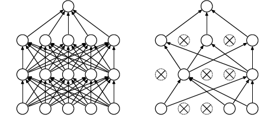

---
jupytext:
  text_representation:
    extension: .md
    format_name: myst
    format_version: 0.13
    jupytext_version: 1.13.0
kernelspec:
  display_name: Python 3 (ipykernel)
  language: python
  name: python3
---

```{code-cell} ipython3
---
slideshow:
  slide_type: skip
---
import torch
import torchvision
from torch import nn
import matplotlib.pyplot as plt
import numpy as np
%matplotlib inline
```

```{code-cell} ipython3
if torch.cuda.is_available():
    device = f"cuda:{torch.cuda.device_count()-1}"
    batch_size = 128
else:
    device='cpu'
    batch_size=128
```

```{code-cell} ipython3
---
slideshow:
  slide_type: skip
---
from torch._utils import _accumulate
def random_split(dataset, lengths):
    r"""
    Randomly split a dataset into non-overlapping new datasets of given lengths.

    Arguments:
        dataset (Dataset): Dataset to be split
        lengths (sequence): lengths of splits to be produced
    """
    if sum(lengths) != len(dataset):
        raise ValueError("Sum of input lengths does not equal the length of the input dataset!")

    indices = torch.randperm(sum(lengths))
    return [torch.utils.data.Subset(dataset, indices[offset - length:offset]) for offset, length in zip(_accumulate(lengths), lengths)]
```

```{code-cell} ipython3

```

+++ {"slideshow": {"slide_type": "slide"}}

## FashionMNIST

```{code-cell} ipython3
---
slideshow:
  slide_type: slide
---
dl_train = torch.utils.data.DataLoader(
    torchvision.datasets.FashionMNIST('../data/f_mnist', train=True, download=True))

dl_test  = torch.utils.data.DataLoader(
    torchvision.datasets.FashionMNIST('../data/f_mnist', train=False, download=True))
```

```{code-cell} ipython3
---
slideshow:
  slide_type: slide
---
data   = dl_train.dataset.data.to(dtype=torch.float32,device=device)[:12000]
labels = dl_train.dataset.targets.to(device=device)[:12000]
```

```{code-cell} ipython3
---
slideshow:
  slide_type: slide
---
fig_mnist, ax = plt.subplots(1,8, figsize=(8*4,4))
for i in range(8):
    ax[i].imshow(data[i].cpu().numpy(), cmap='Greys');
```

|Label|Description|
|-----|-----------|
| 0  |T-shirt/top| 
| 1  | Trouser   |
| 2  | Pullover  |
| 3  | Dress     |
| 4  | Coat      |
| 5  | Sandal   |
| 6  | Shirt    |
|7 | Sneaker|
|8| Bag |
|9| Ankle boot|

```{code-cell} ipython3
labels[0:8]
```

```{code-cell} ipython3
---
slideshow:
  slide_type: slide
---
dataset = torch.utils.data.TensorDataset( 
    (data/256.0).view(-1,28*28), 
    labels)
```

```{code-cell} ipython3
---
slideshow:
  slide_type: '-'
---
train_dataset, validation_dataset = random_split(dataset, (10000,2000))
```

```{code-cell} ipython3
train_loader = torch.utils.data.DataLoader(train_dataset, batch_size=batch_size, shuffle=True)
```

```{code-cell} ipython3
---
slideshow:
  slide_type: slide
---
datasets = [
    torch.utils.data.Subset(train_dataset,torch.randint(len(train_dataset),(len(train_dataset),))) for i in range(5)]
```

```{code-cell} ipython3
---
slideshow:
  slide_type: '-'
---
train_loaders = [torch.utils.data.DataLoader(d, 
                                           batch_size=batch_size, 
                                           shuffle=True) for d in datasets]
```

```{code-cell} ipython3
---
slideshow:
  slide_type: slide
---
test_data   = dl_test.dataset.data.to(dtype=torch.float32)
test_labels = dl_test.dataset.targets
test_dataset = torch.utils.data.TensorDataset(
    (test_data/256.0).view(-1,28*28), test_labels)
```

```{code-cell} ipython3
---
slideshow:
  slide_type: slide
---
models = [torch.nn.Sequential(
    nn.Linear(28*28,20), nn.ReLU(),
    nn.Linear(20,20), nn.ReLU(),
    nn.Linear(20,10)
).to(device=device) for i in range(len(datasets))]
```

```{code-cell} ipython3
---
slideshow:
  slide_type: slide
---
optims = [torch.optim.SGD(models[i].parameters(), lr=0.01, momentum=0.6) for i in range(len(datasets))]
```

```{code-cell} ipython3
---
slideshow:
  slide_type: slide
---
loss_f = nn.CrossEntropyLoss()
```

```{code-cell} ipython3
---
slideshow:
  slide_type: '-'
---
%%time
for i in range(len(datasets)):
    for e in range(10):
        for d in train_loaders[i]:        
            optims[i].zero_grad()
            features, labels = d
            pred = models[i](features)
            loss = loss_f(pred, labels)
            loss.backward()
            optims[i].step()
#        print(i,e,loss.item())        
```

```{code-cell} ipython3
---
slideshow:
  slide_type: slide
---
with torch.no_grad():
    for i in range(len(datasets)):
        pred = torch.softmax(models[i](datasets[i][:][0]),1)
        ac = torch.sum(torch.argmax(pred,1)==datasets[i][:][1]).to(dtype=torch.float32)/len(datasets[i])
        print(ac)  
```

```{code-cell} ipython3
with torch.no_grad():
    for i in range(len(datasets)):
        pred = torch.softmax(models[i](validation_dataset[:][0]),1)
        ac = torch.sum(torch.argmax(pred,1)==validation_dataset[:][1]).to(dtype=torch.float32)/len(validation_dataset)
        print(ac)    
```

```{code-cell} ipython3
---
slideshow:
  slide_type: slide
---
def predict_class (model, inp):
    pred = torch.softmax(model(inp),dim=1)
    return torch.argmax(pred,dim=1)
```

```{code-cell} ipython3
preds = [predict_class(models[i], validation_dataset[:][0]) for i in range(len(datasets))]
```

```{code-cell} ipython3
preds
```

```{code-cell} ipython3
---
slideshow:
  slide_type: slide
---
def vote(predictions):
    npred=torch.stack(predictions, dim=1).cpu().numpy()
    v  = np.apply_along_axis(lambda r: np.bincount(r).argmax(), 1, npred)
    return torch.from_numpy(v)  
```

```{code-cell} ipython3
---
slideshow:
  slide_type: fragment
---
gold = vote(preds)
```

```{code-cell} ipython3
gold
```

```{code-cell} ipython3
---
slideshow:
  slide_type: fragment
---
torch.sum(gold==validation_dataset[:][1].cpu()).item()/len(gold)
```

+++ {"slideshow": {"slide_type": "slide"}}

## Dropout

```{code-cell} ipython3
---
slideshow:
  slide_type: slide
---
model = torch.nn.Sequential(
    nn.Linear(28*28,1200), nn.ReLU(),
    nn.Linear(1200,1200), nn.ReLU(),
    nn.Linear(1200,10)
).to(device=device)
```

```{code-cell} ipython3
---
slideshow:
  slide_type: slide
---
optim = torch.optim.SGD(model.parameters(), lr=0.01 , momentum=0.6)
```

```{code-cell} ipython3
%%time
model.train()
for e in range(1000):
        for d in train_loader:        
            optim.zero_grad()
            features, labels = d
            pred = model(features)
            loss = loss_f(pred, labels)
            loss.backward()
            optim.step()
print(e,loss.item())        
```

```{code-cell} ipython3
---
slideshow:
  slide_type: slide
---
model.eval()
pred = torch.softmax(model(train_dataset[:][0]),1)
ac = torch.sum(torch.argmax(pred,1)==train_dataset[:][1]).to(dtype=torch.float32)/len(train_dataset)
print(ac)
pred = torch.softmax(model(validation_dataset[:][0]),1)
ac = torch.sum(torch.argmax(pred,1)==validation_dataset[:][1]).to(dtype=torch.float32)/len(validation_dataset)
print(ac)
```

+++ {"slideshow": {"slide_type": "-"}}

<p style="text-align:center"></p>

```{code-cell} ipython3
---
slideshow:
  slide_type: slide
---
model = torch.nn.Sequential(
    nn.Linear(28*28,1200), nn.ReLU(),
    nn.Dropout(0.5),
    nn.Linear(1200,1200), nn.ReLU(),
    nn.Dropout(0.5),
    nn.Linear(1200,10)
).to(device=device)
```

```{code-cell} ipython3
---
slideshow:
  slide_type: slide
---
optim = torch.optim.SGD(model.parameters(), lr=0.01 , momentum=0.6)
```

```{code-cell} ipython3
model.train()
for e in range(1000):
        for d in train_loader:        
            optim.zero_grad()
            features, labels = d
            pred = model(features)
            loss = loss_f(pred, labels)
            loss.backward()
            optim.step()
print(e,loss.item())        
```

```{code-cell} ipython3
---
slideshow:
  slide_type: slide
---
model.eval()
pred = torch.softmax(model(train_dataset[:][0]),1)
ac = torch.sum(torch.argmax(pred,1)==train_dataset[:][1]).to(dtype=torch.float32)/len(train_dataset)
print(ac)
pred = torch.softmax(model(validation_dataset[:][0]),1)
ac = torch.sum(torch.argmax(pred,1)==validation_dataset[:][1]).to(dtype=torch.float32)/len(validation_dataset)
print(ac)
```

```{code-cell} ipython3

```
