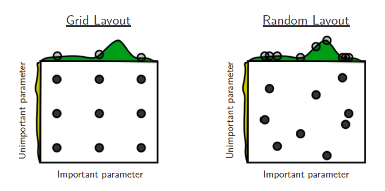

---
jupytext:
  text_representation:
    extension: .md
    format_name: myst
    format_version: 0.13
    jupytext_version: 1.13.0
kernelspec:
  display_name: Python 3 (ipykernel)
  language: python
  name: python3
---

```{code-cell} ipython3
---
slideshow:
  slide_type: skip
---
import torch
import torchvision
from torch import nn
import matplotlib.pyplot as plt
import numpy as np
%matplotlib inline
```

+++ {"slideshow": {"slide_type": "slide"}}

## k-fold Cross Validation

```{code-cell} ipython3
---
slideshow:
  slide_type: skip
---
dl_train = torch.utils.data.DataLoader(
    torchvision.datasets.MNIST('./data/mnist', train=True, download=True))

dl_test  = torch.utils.data.DataLoader(
    torchvision.datasets.MNIST('./data/mnist', train=False, download=True))
```

```{code-cell} ipython3
---
slideshow:
  slide_type: slide
---
data   = dl_train.dataset.data.to(dtype=torch.float32)/255.0
labels = dl_train.dataset.targets
```

```{code-cell} ipython3
---
slideshow:
  slide_type: slide
---
fig_mnist, ax = plt.subplots(1,8, figsize=(8*4,4))
for i in range(8):
    ax[i].imshow(data[i].numpy(), cmap='Greys');
    ax[i].set_xlabel("%d" % (labels[i],), fontsize=16)
```

## Stratification

```{code-cell} ipython3
---
slideshow:
  slide_type: slide
---
by_labels = [data[labels==i] for i in range(10)]
```

```{code-cell} ipython3
---
slideshow:
  slide_type: fragment
---
small_data  = torch.cat([by_labels[i][np.random.choice(len(by_labels[i]),100, replace=False)] for i in range(10)],0)
```

```{code-cell} ipython3
---
slideshow:
  slide_type: fragment
---
small_data.shape
```

```{code-cell} ipython3
---
slideshow:
  slide_type: fragment
---
small_labels = torch.cat([i*torch.ones(100, dtype=torch.int64) for i in range(10)])
```

```{code-cell} ipython3
---
slideshow:
  slide_type: slide
---
perm = np.random.choice(len(small_data), len(small_data), replace=False)
```

```{code-cell} ipython3
---
slideshow:
  slide_type: '-'
---
shuffled_data = small_data[perm]
shuffled_labels = small_labels[perm]
```

```{code-cell} ipython3
---
slideshow:
  slide_type: slide
---
data_folds  = torch.stack(torch.chunk(shuffled_data,5))
label_folds = torch.stack(torch.chunk(shuffled_labels,5))
```

```{code-cell} ipython3
---
slideshow:
  slide_type: skip
---
 loss_f = nn.CrossEntropyLoss()
```

```{code-cell} ipython3
def make_model():
    return torch.nn.Sequential(
        nn.Linear(28*28,1024), nn.ReLU(), nn.Linear(512,256), nn.ReLU(),
        nn.Linear(256,128), nn.ReLU(),nn.Linear(128,10)
    )
```

```{code-cell} ipython3
---
slideshow:
  slide_type: slide
---
 for lr in [0.0001, 0.001, 0.01 , 0.05, 0.1, 0.2, 0.5, 1.0]: 
    avg_ac = 0.0    
    for i in range(5):
        chunks = list(range(5))
        chunks.remove(i)
        kData    = data_folds[chunks].reshape(-1,28*28)
        kLabels   = label_folds[chunks].reshape(-1)

        dataset = torch.utils.data.TensorDataset(kData, kLabels)
        train_loader = torch.utils.data.DataLoader(dataset, batch_size=50, shuffle=True)
        model = make_model()
        optim = torch.optim.SGD(model.parameters(), lr=lr, momentum=0.6)
        
        for e in range(50):
            for d in train_loader:        
                optim.zero_grad()
                features, labels = d
                pred = model(features)
                loss = loss_f(pred, labels)
                loss.backward()
                optim.step()
        with torch.no_grad():
            pred = torch.softmax(model(data_folds[i].view(-1,28*28)),1)
            ac = torch.sum(torch.argmax(pred,1)==label_folds[i]).to(dtype=torch.float32)/len(label_folds[i])
            avg_ac += ac
            #print(i, ac)
    print(lr, avg_ac/5.0)        
```

```{code-cell} ipython3
---
slideshow:
  slide_type: slide
---
 for t in range(8):
    u = np.random.uniform(-3,-1)
    lr = np.exp(u)
    avg_ac = 0.0    
    for i in range(5):
        chunks = list(range(5))
        chunks.remove(i)
        kData    = data_folds[chunks].reshape(-1,28*28)
        kLabels   = label_folds[chunks].reshape(-1)

        dataset = torch.utils.data.TensorDataset(kData, kLabels)
        train_loader = torch.utils.data.DataLoader(dataset, batch_size=50, shuffle=True)
        model = make_model()
        optim = torch.optim.SGD(model.parameters(), lr=lr, momentum=0.6)
        
        for e in range(50):
            for d in train_loader:        
                optim.zero_grad()
                features, labels = d
                pred = model(features)
                loss = loss_f(pred, labels)
                loss.backward()
                optim.step()
        with torch.no_grad():
            pred = torch.softmax(model(data_folds[i].view(-1,28*28)),1)
            ac = torch.sum(torch.argmax(pred,1)==label_folds[i]).to(dtype=torch.float32)/len(label_folds[i])
            avg_ac += ac
            #print(i, ac)
    print(lr, avg_ac/5.0)        
```

+++ {"slideshow": {"slide_type": "slide"}}


