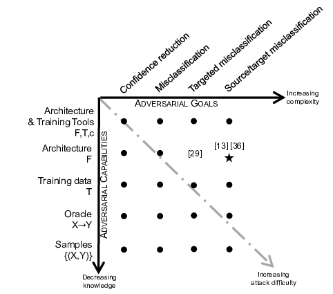
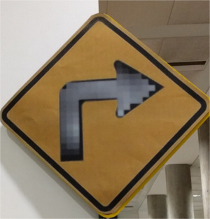
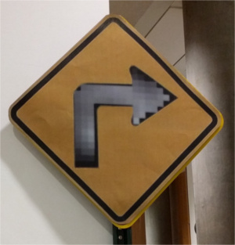

---
jupytext:
  cell_metadata_json: true
  text_representation:
    extension: .md
    format_name: myst
    format_version: 0.13
    jupytext_version: 1.13.0
kernelspec:
  display_name: Python 3 (ipykernel)
  language: python
  name: python3
---

```{code-cell} ipython3
%load_ext autoreload
%autoreload 2
```

+++ {"slideshow": {"slide_type": "slide"}}

# Adversarial Examples

```{code-cell} ipython3
---
slideshow:
  slide_type: skip
---
import os
from IPython.display import clear_output, display
import numpy as np
import matplotlib.pyplot as plt
plt.rcParams['figure.figsize'] = [10.0, 8.0]

import torch as t
from torch.nn import Sequential, Linear, ReLU, LeakyReLU, BatchNorm1d
import torchvision

import utils as u
```

```{code-cell} ipython3
---
slideshow:
  slide_type: skip
---
%matplotlib inline
```

```{code-cell} ipython3
---
slideshow:
  slide_type: skip
---
if t.cuda.is_available():
    if t.cuda.device_count()>1:
        device = t.device('cuda:1')
    else:
        device = t.device('cuda')   
else:
    device = t.device('cpu')
```

+++ {"slideshow": {"slide_type": "slide"}}

## MNIST

```{code-cell} ipython3
---
slideshow:
  slide_type: skip
---
dl_train = t.utils.data.DataLoader(
    torchvision.datasets.MNIST('../../data/mnist', train=True, download=True))

dl_test  = t.utils.data.DataLoader(
    torchvision.datasets.MNIST('../../data/mnist', train=False, download=True))
```

```{code-cell} ipython3
---
slideshow:
  slide_type: skip
---
mnist_train_data   = dl_train.dataset.data.to(dtype=t.float32).view(-1,28*28)/255.0
mnist_train_labels = dl_train.dataset.targets
```

```{code-cell} ipython3
---
slideshow:
  slide_type: skip
---
mnist_test_data   = dl_test.dataset.data.to(dtype=t.float32).view(-1,28*28)/255.0
mnist_test_labels = dl_test.dataset.targets
```

```{code-cell} ipython3
---
slideshow:
  slide_type: skip
---
train_dataset = t.utils.data.TensorDataset(mnist_train_data, mnist_train_labels)
test_dataset = t.utils.data.TensorDataset(mnist_test_data, mnist_test_labels)
```

```{code-cell} ipython3
---
slideshow:
  slide_type: skip
---
train_loader = t.utils.data.DataLoader(train_dataset, batch_size=128)
```

```{code-cell} ipython3
---
slideshow:
  slide_type: slide
---
if os.path.isfile('mnist_home_model.pt'):
    model = t.load('mnist_home_model.pt')
    pretrained = True
else:        
    model = u.make_model(32, drop=0.0)
    model.apply(u.init_layer)
    pretrained = False
```

+++ {"slideshow": {"slide_type": "slide"}}

```python 
def make_model(width, drop):
    return t.nn.Sequential(t.nn.Linear(28*28, 2*width), 
                           t.nn.Dropout(drop), t.nn.ReLU(),
                           t.nn.Linear(2*width, width), 
                           t.nn.Dropout(drop),  t.nn.ReLU(),
                           t.nn.Linear(width, width),
                           t.nn.Dropout(drop),  t.nn.ReLU(),
                           t.nn.Linear(width, 10)
                   )
```

```{code-cell} ipython3
u.numel(model)
```

```{code-cell} ipython3
---
slideshow:
  slide_type: skip
---
model.to(device)
```

```{code-cell} ipython3
---
slideshow:
  slide_type: slide
---
u.accuracy(model, test_dataset[:][0], test_dataset[:][1])
```

```{code-cell} ipython3
---
slideshow:
  slide_type: skip
---
ce = t.nn.CrossEntropyLoss()
optimizer = t.optim.Adam(model.parameters(), lr=0.0002)
```

```{code-cell} ipython3
---
slideshow:
  slide_type: skip
---
%%time
if not pretrained:
    err_train=[]
    err_valid=[]
    for epoch in range(20):    
        for datum in train_loader:
            optimizer.zero_grad()
            (features,target) = datum
            pred = model(features)
            loss = ce(pred, target)
            loss.backward()
            optimizer.step()

        with t.no_grad():
            vpred  = model(test_dataset[:][0])
            vloss  = ce(vpred,test_dataset[:][1])
            err_valid.append(vloss)
            pred  = model(train_dataset[:][0])
            loss  = ce(pred,train_dataset[:][1])
            err_train.append(loss)
        clear_output()
        print("epoch %d %f %f %f" % (epoch, loss, vloss,u.accuracy(model, test_dataset[:][0],  test_dataset[:][1])))   

    plt.plot(err_train,c='b')
    plt.plot(err_valid,c='g')
```

```{code-cell} ipython3
---
slideshow:
  slide_type: '-'
---
print(u.accuracy(model, test_dataset[:][0],  test_dataset[:][1]) )
print(u.accuracy(model, train_dataset[:][0], train_dataset[:][1]) )
```

```{code-cell} ipython3
---
slideshow:
  slide_type: skip
---
if not os.path.isfile('mnist_home_model.pt'):
    t.save(model,"mnist_home_model.pt")
```

```{code-cell} ipython3
---
slideshow:
  slide_type: slide
---
example = t.load('real_5.pt')
fake    = t.load('fake_4.pt')
```

```{code-cell} ipython3
---
slideshow:
  slide_type: slide
---
u.display(example);
```

```{code-cell} ipython3
---
slideshow:
  slide_type: fragment
---
u.prediction(model,example)
```

```{code-cell} ipython3
---
slideshow:
  slide_type: slide
---
u.display(fake);
```

```{code-cell} ipython3
---
slideshow:
  slide_type: fragment
---
u.prediction(model,fake)
```

+++ {"slideshow": {"slide_type": "slide"}}

<table>
<tr>
    <td></td>
    <td></td>
    <td></td>
    </tr>
</table>

+++

> "Explaining and Harnessing Adversarial Examples", Ian J. Goodfellow, Jonathon Shlens, Christian Szegedy [arXiv:1412.6572](https://arxiv.org/abs/1412.6572)

+++ {"slideshow": {"slide_type": "slide"}}

## Rubish class

```{code-cell} ipython3
---
slideshow:
  slide_type: slide
---
A = t.empty(1,28*28,device=device).uniform_(0,1)
```

```{code-cell} ipython3
---
slideshow:
  slide_type: fragment
---
plt.imshow(A.data.cpu().numpy().reshape(28,28), cmap='Greys');
```

```{code-cell} ipython3
---
slideshow:
  slide_type: fragment
---
u.prediction(model, A)
```

+++ {"slideshow": {"slide_type": "slide"}}

$$\newcommand{\argmin}{\operatorname{argmin}}$$
$$\argmin_A J(A, target)$$

```{code-cell} ipython3
---
slideshow:
  slide_type: slide
---
target = t.LongTensor([4]).to(device)
```

```{code-cell} ipython3
---
slideshow:
  slide_type: fragment
---
pred = model(A)
ce(pred,target)
```

```{code-cell} ipython3
---
slideshow:
  slide_type: fragment
---
u.model_detach(model)
```

```{code-cell} ipython3
---
slideshow:
  slide_type: fragment
---
A.requires_grad_(True);
```

```{code-cell} ipython3
---
slideshow:
  slide_type: fragment
---
adv_optimizer = t.optim.SGD([A],lr=0.002)
```

```{code-cell} ipython3
---
slideshow:
  slide_type: slide
---
%%time
for i in range(5000):
    adv_optimizer.zero_grad()
    pred = model(A)
    loss =ce(pred,target)
    loss.backward()
    adv_optimizer.step()
    #clear_output()
print(loss.item())
```

```{code-cell} ipython3
---
slideshow:
  slide_type: slide
---
plt.imshow(A.data.cpu().numpy().reshape(28,28), cmap='Greys');
```

```{code-cell} ipython3
---
slideshow:
  slide_type: fragment
---
pred = model(A)
ce(pred,target)
```

```{code-cell} ipython3
---
slideshow:
  slide_type: fragment
---
u.prediction(model, A)
```

+++ {"slideshow": {"slide_type": "slide"}}

## Source/Target  attack

```{code-cell} ipython3
---
slideshow:
  slide_type: slide
---
idx = 490
X = train_dataset[idx:idx+1][0].clone()
L = train_dataset[idx:idx+1][1]
print(L.item())
```

```{code-cell} ipython3
---
slideshow:
  slide_type: fragment
---
plt.imshow(X.data.cpu().numpy().reshape(28,28), cmap='Greys');
```

```{code-cell} ipython3
---
slideshow:
  slide_type: slide
---
A = t.empty(1,28*28,device=device).uniform_(0,1)
A.requires_grad_(True);
```

```{code-cell} ipython3
plt.imshow(A.data.cpu().numpy().reshape(28,28), cmap='Greys');
```

```{code-cell} ipython3
---
slideshow:
  slide_type: fragment
---
u.prediction(model, A)
```

```{code-cell} ipython3
---
slideshow:
  slide_type: fragment
---
target = t.LongTensor([4]).to(device)
```

```{code-cell} ipython3
---
slideshow:
  slide_type: fragment
---
pred = model(A)
ce(pred,target)
```

```{code-cell} ipython3
---
slideshow:
  slide_type: slide
---
adv_optimizer = t.optim.Adam([A],lr=0.0001, betas=(0.5, 0.999))
```

```{code-cell} ipython3
---
slideshow:
  slide_type: fragment
---
%%time
for i in range(20000):
    adv_optimizer.zero_grad()
    pred = model(A)
    loss =ce(pred,target)+1.0*t.norm(A-X)
    loss.backward()
    adv_optimizer.step()
    #clear_output()
print(loss.item())
```

```{code-cell} ipython3
---
slideshow:
  slide_type: slide
---
fig,ax = plt.subplots(1,2)
ax[0].imshow(A.data.cpu().numpy().reshape(28,28), cmap='Greys')
ax[1].imshow(X.data.cpu().numpy().reshape(28,28), cmap='Greys');
```

```{code-cell} ipython3
---
slideshow:
  slide_type: fragment
---
pred = model(A)
ce(pred,target)
```

```{code-cell} ipython3
---
slideshow:
  slide_type: fragment
---
u.prediction(model, A)
```

```{code-cell} ipython3
---
slideshow:
  slide_type: slide
---
noise = A-X
```

```{code-cell} ipython3
---
slideshow:
  slide_type: fragment
---
t.max(noise.abs() )
```

```{code-cell} ipython3
---
slideshow:
  slide_type: fragment
---
n_image=plt.imshow(noise.data.cpu().numpy().reshape(28,28), cmap='viridis', vmin=-1, vmax = 1 );
plt.colorbar();
```

```{code-cell} ipython3
---
slideshow:
  slide_type: skip
---
u.prediction(model, X+noise)
```

+++ {"slideshow": {"slide_type": "slide"}}

## Taxonomy

+++ {"slideshow": {"slide_type": "slide"}}



+++

> "The Limitations of Deep Learning in Adversarial Settings", Nicolas Papernot, Patrick McDaniel, Somesh Jha, Matt Fredrikson, Z. Berkay Celik, Ananthram Swami [arXiv:1511.07528](https://arxiv.org/abs/1511.07528)

+++ {"slideshow": {"slide_type": "slide"}}

## Real World Examples

+++

> "Adversarial examples in the physical world", Alexey Kurakin, Ian Goodfellow, Samy Bengio [arXiv:1607.02533](https://arxiv.org/abs/1607.02533)

+++ {"slideshow": {"slide_type": "slide"}}

<table>
    <tr>
        <td></td>
        <td></td>
    </tr>
</table>

+++ {"slideshow": {"slide_type": "slide"}}

<table>
    <tr>
        <td></td>
        <td></td>
    </tr>
</table>

+++

> "Robust Physical-World Attacks on Deep Learning Models", Kevin Eykholt, Ivan Evtimov, Earlence Fernandes, Bo Li, Amir Rahmati, Chaowei Xiao, Atul Prakash, Tadayoshi Kohno, Dawn Song [arXiv:1707.08945](https://arxiv.org/abs/1707.08945).

+++ {"slideshow": {"slide_type": "slide"}}

<table>
    <tr>
        <td></td>
        <td></td>
    </tr>
</table>

+++ {"slideshow": {"slide_type": "slide"}}

<table>
    <tr>
        <td></td>
        <td></td>
    </tr>
</table>

+++ {"slideshow": {"slide_type": "slide"}}

<table>
    <tr>
        <td></td>
        <td></td>
    </tr>
</table>

+++ {"slideshow": {"slide_type": "slide"}}

<table>
    <tr>
        <td></td>
        <td></td>
    </tr>
</table>

```{code-cell} ipython3

```
